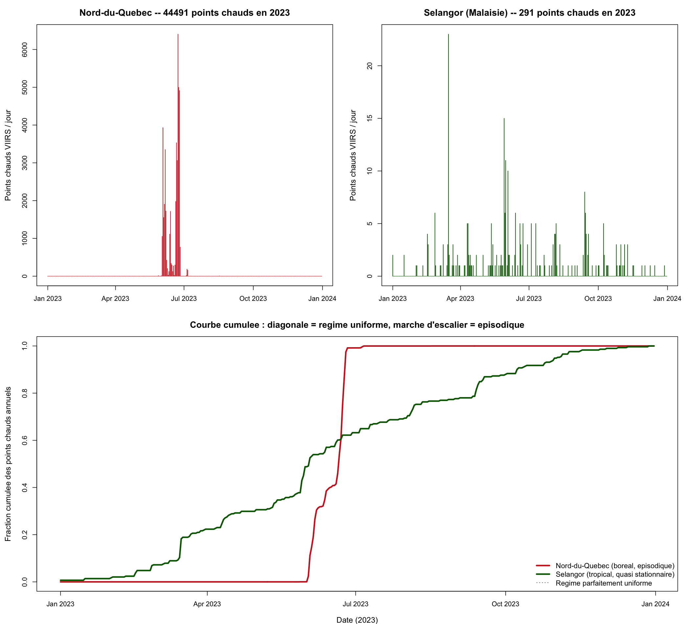

# Discussion et conclusion

## Discussion

Quand on regarde comment les choses se passent au Québec, on aperçoit qu'on fait affaire à un cas où les feux sont concentrés à une période particulière de l'année (se référer à la figure ci-dessous)

{#fig-crsng fig-align="left" width=50%}