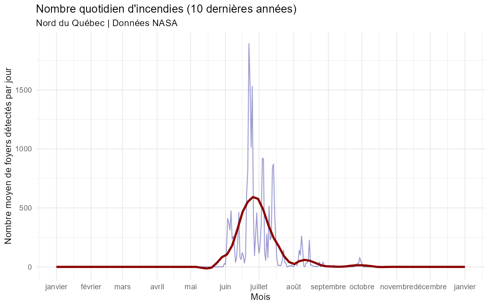

# Discussion et conclusion

## Discussion

Quand on regarde comment les choses se passent au Québec, on aperçoit qu'on fait affaire à un cas où les feux sont concentrés à une période particulière de l'année (se référer à la figure ci-dessous).

{#fig-crsng fig-align="left" width=100%}

Pour le Québec, on aperçoit un pic de feux entre les mois de juin et de juillet, quand on compare au nombre de feux en malaisie, qui est assez uniforme, on se rend compte que les feux sont répartis très densément au Québec. Il est intuitif de voir la fonction $k_Q(t)$ comme une fonction qui atteint un sommet quelque part au début de l'été et qui est presque nulle partout ailleurs. Si on prend la moyenne des 10 dernières années, on obtient:

{#fig-saison-feux fig-align="center" width=95%}

Le sommet est clairement atteint vers la fin du mois de juin ou le début du mois de juillet.

